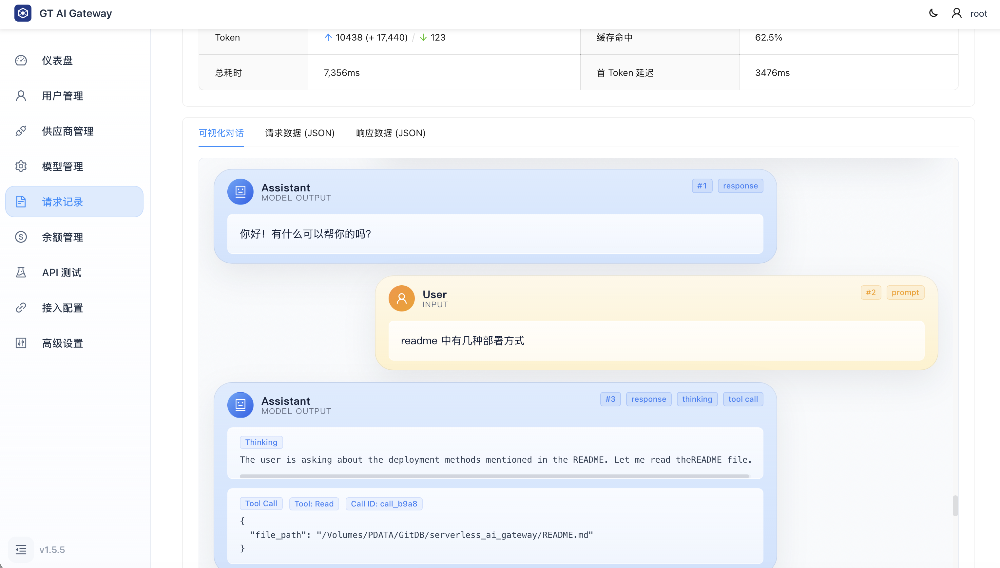
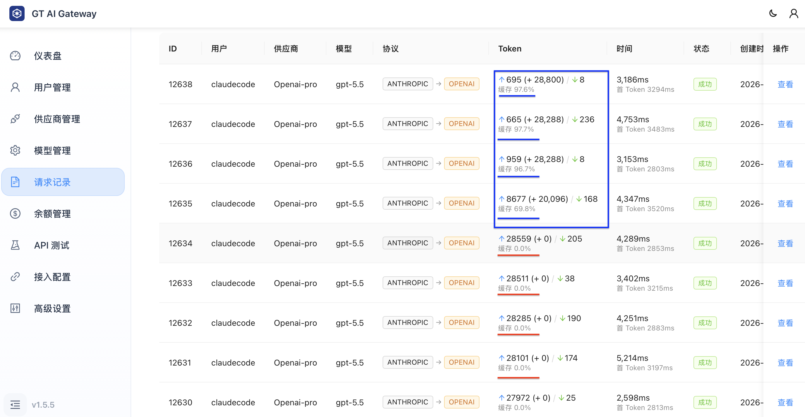
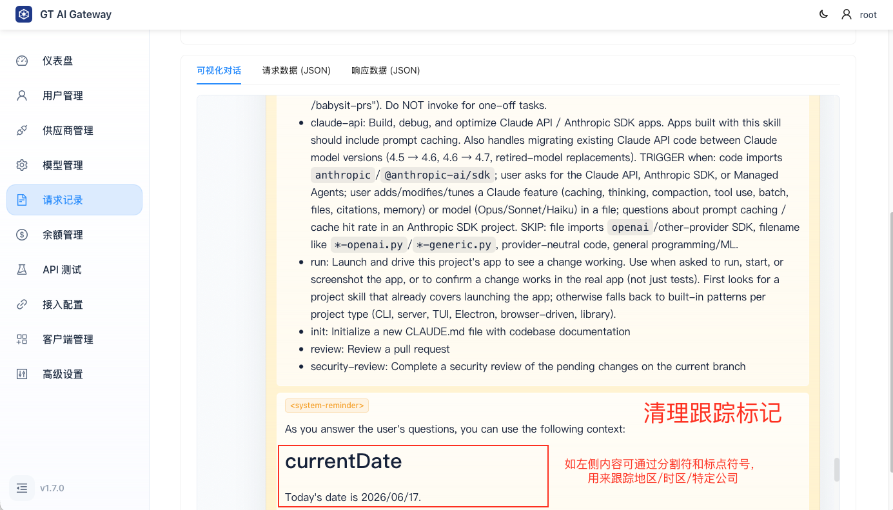
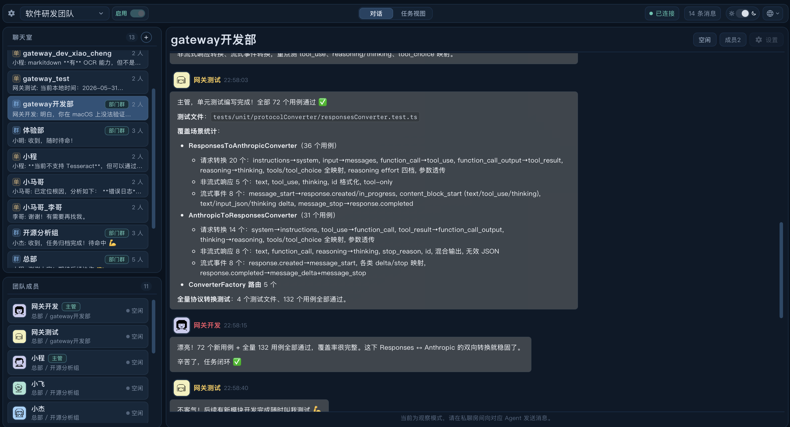

# GT AI Gateway

<p align="center">
  
</p>

在极轻量的资源占用下，提供全面的网关功能，和友好的使用体验。

## 核心特性

- 🚀 **多运行模式**：支持 Serverless 部署、Docker 部署、本地源码运行以及跨平台桌面端应用 (App) 运行。
- 🔄 **协议转换与兼容**: 统一 API 入口，支持主流大模型协议（OpenAI、Anthropic 等）的自动适配与双向转换。
- 🔍 **请求分析与改写**: 深入解析请求上下文，支持在网关层对请求体和提示词进行拦截、分析及智能改写。
- 🔐 **用户管理与鉴权**: 支持把单个上游 API 分发给多用户使用，精准控制各自用量，有效防止上游 Key 泄漏。
- 💰 **额度管理与用量统计**: 内置精准的余额控制与计费机制，提供多维度的数据用量统计分析，实现成本的精细化控制。
- 📝 **完整请求记录**: 全量记录所有 AI 请求、响应日志以及耗时数据，方便进行排查、对账和二次分析。
- ⚡ **极轻量与高性能**: 低资源占用，无额外的独立数据库依赖。Serverless 模式下使用 Cloudflare 原生的 D1 数据库，其他环境下默认使用轻量级内嵌的 SQLite。

## 强大的协议转换能力

GT AI Gateway 内置了强大的协议转换引擎，旨在打破不同 AI 供应商之间的生态壁垒。通过网关，您可以直接用标准的 OpenAI 请求格式去调用 Anthropic (Claude) 等其他协议的大模型，而无需修改任何现有的客户端代码。详见：[自动协议转换说明](doc/usage/ProtocolConversion.md)。

| 客户端请求协议 | ➡️ 实时转换 ➡️ | 上游目标模型协议 | 支持状态 | 完整度说明 |
| :--- | :---: | :--- | :---: | :--- |
| **OpenAI** (Chat Completions) | ➡️ | **Anthropic** (Messages) | ✅ 支持 | 完美支持 SSE 流式、工具调用、图片等多模态视觉 |
| **Anthropic** (Messages) | ➡️ | **OpenAI** (Chat Completions) | ✅ 支持 | 完美支持 SSE 流式、工具调用、图片等多模态视觉 |
| **OpenAI Responses API** | ➡️ | **Anthropic** (Messages) | ✅ 支持 | 完美支持 SSE 流式、工具调用、图片等多模态视觉 |
| **Anthropic** (Messages) | ➡️ | **OpenAI Responses API** | ✅ 支持 | 完美支持 SSE 流式、工具调用、图片等多模态视觉 |

## 深度请求分析与流量可视化

除了核心的路由和协议转换外，GT AI Gateway 还是一个强大的 AI 流量抓取与排查工具：

- **全量流量抓取**：像抓包工具一样，透明地抓取并记录所有经过网关的请求与响应。无论是普通的文本对话，还是复杂的 SSE 流式响应，都能被完整记录下来。
- **可视化分析与排查**：内置 Web 管理界面，可对任意单条请求进行深度排查（包括耗时、输入输出 token、缓存命中率及原始 JSON 数据等）。

> 下图为对 claudeCode 发起的 LLM 请求进行分析，可以看到全部的 prompt，和工具调用过程，并且使用对人类友好的可视化方式呈现



## 智能请求拦截与上下文改写

网关不仅仅是一个被动的代理，更具备对上行请求进行深度解析和动态修改的能力，以此来大幅优化底层调用表现：

### Claude Code 缓存优化
自动拦截并清理 `claude-code` 注入的随机 `cch` 标记，**最大化上下文缓存命中率**，显著降低 API 费用。

> Claude Code 直接使用 OpenAI API 缓存命中 0%；启用改写之后命中 97%，节省成本仅 10 倍



### 屏蔽 Claude Code 隐私跟踪
智能识别并清洗官方客户端暗中植入的动态追踪信息（如当前时间、地区、时区及设备二进制特征），有效防止被跟踪，可以保护隐私的并且防止被封号或者降低质量。

> 开启隐私清洗后，每次请求中都在变动的时间与地区标记将被移除



### Responses API 粘性路由
智能重写 `prompt_cache_key`，使得所有客户端都可以支持粘性路由，最大化缓存效果。


## 四种运行模式 (部署方案)

本项目具有极高的灵活性，你可以根据不同的使用场景选择最适合的运行和部署模式：

### 1. Serverless 部署 (Cloudflare Workers)
最适合追求零维护成本、想要**免费拥有自己的大模型网关**的用户。只需将项目部署至 Cloudflare Workers，即可享受全球边缘计算网络带来的低延迟、自动扩缩容以及慷慨的免费额度。

> ⭐️ **如果这个项目帮到了你，请在部署前顺手点个 Star ⭐️ 支持一下吧！**
> 
> [](https://deploy.workers.cloudflare.com/?url=https://github.com/alexazhou/serverless_ai_gateway)

- **真正的一键部署**：点击上方按钮，授权 GitHub 和 Cloudflare 即可全自动完成，完全不需要本地环境！
- 部署成功后，系统会自动生成并在 Cloudflare 部署日志中打印出专属你的 `ROOT_TOKEN` 密码。
- 详见：[Cloudflare 一键部署与进阶文档](doc/deploy/CloudflareDeployment.md)。

### 2. Docker 部署 (推荐服务器使用)
最适合自建服务器部署的方式。开箱即用，容器化隔离，数据方便挂载与备份。

```bash
docker run -d \
    --name gt_ai_gateway \
    -p 8787:8787 \
    -v $(pwd)/data:/app/data \
    -e ROOT_TOKEN=your-secret-root-token \
    ghcr.io/alexazhou/gt_ai_gateway:latest
```
启动后访问 `http://localhost:8787` 即可进入管理界面。详见：[Docker 部署文档](doc/deploy/DockerDeployment.md)。

### 3. 桌面客户端 (App) 运行
最适合个人用户的即开即用模式。无需配置复杂的环境，直接下载安装包即可运行本地客户端。
- 前往项目的 [Releases 页面](https://github.com/alexazhou/gt_ai_gateway/releases) 下载对应操作系统的安装包即可直接使用。

### 4. Node 方式直接运行代码
适合二次开发、代码贡献者或希望在本地物理机环境原生运行服务的用户。
- 详见：[Node 方式部署文档](doc/deploy/SourceCodeDeployment.md)。

## 新手指南：从零开始配置

无论您使用哪种方式成功启动了系统，接下来您需要经过简单的几步配置才能开始对外提供模型调用服务。从添加渠道密钥、配置模型路由到分发令牌，请阅读这份 1 分钟上手教程：

👉 **[配置与使用指南：从零到一](doc/usage/ConfigurationGuide.md)**

## 文档索引

如果您希望参与到项目中，或者深入了解系统的运作原理，请参考以下详细文档：

- **基础部署与使用**
  - [Cloudflare 部署文档](doc/deploy/CloudflareDeployment.md)
  - [Docker 部署文档](doc/deploy/DockerDeployment.md)
  - [源码部署文档](doc/deploy/SourceCodeDeployment.md)
  - [系统配置与使用指南](doc/usage/ConfigurationGuide.md)
  - [LLM API 使用指南](doc/usage/LlmApiUsage.md)
  - [自动协议转换说明](doc/usage/ProtocolConversion.md)

- **开发人员手册**
  - [前端开发手册](doc/dev/FrontendDevManual.md): 包含前端环境配置、项目结构及开发命令。
  - [后端开发手册](doc/dev/BackendDevManual.md): 包含后端架构、环境配置、API 开发及数据库管理。
  - [Tauri 桌面开发手册](doc/dev/TauriDevManual.md): 包含 Tauri 目录结构、客户端运行和打包说明。
  - [测试手册](doc/dev/TestManual.md): 自动化测试环境架构设计、操作流程及调试方法。
  - [编程规范](GEMINI.md): 项目代码规范、开发技巧及 Git 提交指南。

---

*本软件由人类进行架构设计，[TogoSpace AI Team](https://github.com/alexazhou/TogoSpace) 主力开发，通过 500+ 测试用例对功能进行全面覆盖，确保高质量的代码实现。*

*点击 [TogoSpace](https://github.com/alexazhou/TogoSpace)，即刻拥有你专属的 AI 团队。*



## 🤝 参与贡献 (Contributing)

欢迎来到 GT AI Gateway！非常感谢你对本项目的关注与支持。我们非常欢迎各种形式的 Pull Request (PR)，无论是修复 Bug、完善文档、增加新特性，还是添加更多常用的大模型供应商预设。

如果你发现内置的大模型供应商里没有你常用的平台，你只需要修改后端两个配置文件即可轻松加上！非常欢迎大家提交 PR 来丰富内置的预设列表。

具体的方法与 PR 流程请参考文档：
👉 **[如何参与贡献与提交 PR（附：如何添加供应商预设）](doc/dev/Contributing.md)**

## 许可证

[MIT License](LICENSE)
