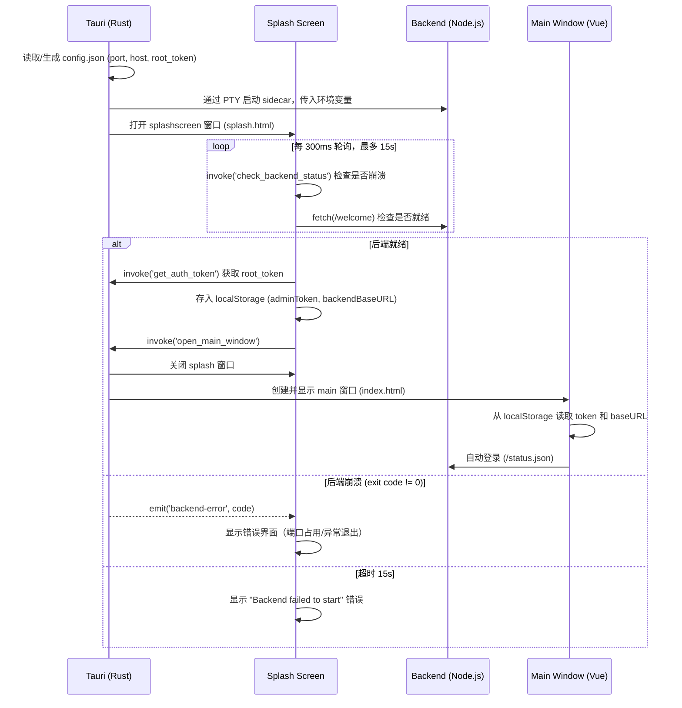

# Tauri 桌面应用开发手册

## 目录结构

```
tauri/
├── app-icon.svg                    # 应用图标 SVG 源文件
├── tray-icon-source.svg            # 托盘图标 SVG 源文件
├── package.json                    # Tauri 前端依赖（@tauri-apps/cli 等）
├── build/
│   ├── binaries/                   # sidecar 二进制存放目录
│   │   └── ai-gateway-backend-aarch64-apple-darwin
│   ├── dist-backend/               # esbuild 打包的后端 JS bundle
│   │   └── index.js
│   └── target/                     # Cargo 编译输出（自动生成）
│       └── debug/
│           ├── ai-gateway          # Tauri 主程序（Rust 编译产物）
│           └── ai-gateway-backend  # sidecar 副本（由 Tauri build 复制）
└── src-tauri/
    ├── Cargo.toml
    ├── build.rs
    ├── tauri.conf.json             # Tauri 核心配置
    ├── icons/                      # 应用图标（各分辨率）
    └── src/
        └── lib.rs                  # Rust 主逻辑
```

## 启动开发环境

在项目根目录下，直接运行以下命令即可启动 Tauri 的 Dev 模式（会自动同时启动前端 Vite 开发服务器和后端桌面应用）：

```bash
npm run tauri dev
```

## 运行模式对比

### Dev 模式 (`npm run tauri dev`)

| 项目 | 值 |
|------|------|
| 前端来源 | Vite dev server（`http://localhost:8721`） |
| Rust 可执行文件 | `tauri/build/target/debug/ai-gateway` |
| Sidecar 路径 | `tauri/build/target/debug/ai-gateway-backend` |
| Resource 目录 | `tauri/build/target/debug/../Resources/resource` ❌ **不存在** |
| 数据库 | `~/Library/Application Support/GtCoder/AiGateway/gateway.db` |
| 日志目录 | `~/Library/Application Support/GtCoder/AiGateway/logs/` |
| 配置文件 | `~/Library/Application Support/GtCoder/AiGateway/config.json` |

### Production 模式 (`npm run tauri build`)

| 项目 | 值 |
|------|------|
| 前端来源 | 打包到 `.app/Contents/Resources/` 的静态文件 |
| Rust 可执行文件 | `.app/Contents/MacOS/ai-gateway` |
| Sidecar 路径 | `.app/Contents/MacOS/ai-gateway-backend` |
| Resource 目录 | `.app/Contents/Resources/resource` ✅ 存在 |
| 数据库 | `~/Library/Application Support/GtCoder/AiGateway/gateway.db` |
| 日志目录 | `~/Library/Application Support/GtCoder/AiGateway/logs/` |
| 配置文件 | `~/Library/Application Support/GtCoder/AiGateway/config.json` |

## 启动流程



## Rust → Backend 环境变量

Tauri Rust 在启动 sidecar 时传入以下环境变量：

| 环境变量 | 来源 | 说明 |
|----------|------|------|
| `DB_PATH` | `app_data_dir/gateway.db` | 数据库文件路径 |
| `PORT` | `config.json` 或默认 `6722` | 后端监听端口 |
| `HOST` | `config.json` 或默认 `127.0.0.1` | 后端监听地址 |
| `LOG_DIR` | `app_data_dir/logs` | 日志输出目录 |
| `ROOT_TOKEN` | `config.json`（首次自动生成） | 管理员认证令牌 |
| `DESKTOP_MODE` | 固定值 `"1"` | 标识桌面模式 |
| `MIGRATION_DIR` | `resource_dir/migrate` | 数据库迁移文件目录 |

## 前端环境变量

前端页面（如启动画面）可以通过 Vite 注入环境变量。

| 环境变量 | 来源 | 说明 |
|----------|------|------|
| `VITE_SPLASH_DELAY_SEC` | `.env.development` 或 CLI | 控制启动画面的最少停留秒数（例如 `3` 表示额外等待 3 秒）。用于本地调试 UI。默认为 `0`。 |

## Splash → Main 窗口通信

两个窗口通过 **同源 localStorage** 传递数据（Tauri dev 模式下都加载自同一个 Vite dev server）：

| localStorage Key | 用途 | 写入方 | 读取方 |
|------------------|------|--------|--------|
| `adminToken` | root_token，用于 API 认证 | splash.ts | main.ts → authSession.ts |
| `backendBaseURL` | 后端 URL（如 `http://127.0.0.1:6722`） | splash.ts | main.ts → request.ts |

## Tauri 配置要点 (tauri.conf.json)

```json
{
    "build": {
        "frontendDist": "../../frontend/dist",      // 生产模式前端产物
        "devUrl": "http://localhost:8721",           // dev 模式 Vite 地址
        "beforeDevCommand": "cd ../frontend && npm run dev",
        "beforeBuildCommand": "cd ../frontend && npm run build:tauri"
    },
    "app": {
        "windows": [{
            "label": "splashscreen",                // 窗口标识
            "url": "splash.html",                   // 加载的页面
            "width": 500, "height": 340,
            "decorations": false, "transparent": true
        }]
    },
    "bundle": {
        "resources": {
            "../../resource/migrate/*": "resource/migrate/"  // 迁移文件打包
        },
        "externalBin": [
            "../build/binaries/ai-gateway-backend"           // sidecar 二进制
        ]
    }
}
```

> [!NOTE]
> `externalBin` 配置的路径相对于 `src-tauri` 目录。Tauri 在编译时会自动追加目标三元组后缀（如 `-aarch64-apple-darwin`），并将二进制复制到 `target/debug/`（dev）或 `.app/Contents/MacOS/`（production），复制时**去掉**三元组后缀。

## Dev 模式下的 Sidecar (后端) 运行机制

> [!IMPORTANT]
> 这是 Tauri Dev 模式下**最核心的改动之一**。理解这一点能帮你避免“为什么我改了后端代码但不生效”的疑惑。

Tauri 的原生机制是执行一个编译好的、独立的二进制文件（Sidecar）。
但在开发阶段，如果每次修改后端代码都要重新用 esbuild 打包成 bundle 再重启，效率会极低。另外 Tauri 要求的 sidecar 二进制在 `tauri/build/binaries` 目录下很容易被打包命令覆盖。

为此，我们在 Rust 主进程代码（`src/lib.rs`）中使用了**条件编译**来改变 Dev 模式下的行为：

```rust
#[cfg(debug_assertions)]
let (mut cmd, migration_dir) = {
    // Dev 模式下直接运行源码，实现热加载，同时避免被 pkg 构建覆盖
    let project_root = exe_dir.join("../../../..");
    let mut c = std::process::Command::new("npx");
    c.arg("tsx").arg("src/local.ts");
    c.current_dir(&project_root);
    (c, project_root.join("resource/migrate").to_string_lossy().into_owned())
};

#[cfg(not(debug_assertions))]
let (mut cmd, migration_dir) = {
    // Prod 模式下运行打包好的 pkg 独立二进制文件
    // ...
};
```

### 这个机制带来的优势：
1. **源码级运行**：它不依赖任何预编译的 bundle 文件或 Bash 占位脚本，而是直接通过 `npx tsx src/local.ts` 运行源代码。
2. **改动即生效**：在本地开发时，只要你修改了 `src/` 目录下的任何后端代码，**只需重启 Tauri App 就能立刻运行最新代码**，省去了手动编译后端的繁琐步骤。
3. **修复路径丢失**：Dev 模式下自动将 `MIGRATION_DIR` 指向了项目根目录下的资源文件，解决了 `.app` 目录结构不存在导致的找不到数据表的问题。
4. **Git 与构建友好**：彻底摆脱了会被 `.gitignore` 忽略、也会被 `npm run tauri:build-backend` 命令覆盖的 Bash 占位脚本。

## 其他 Dev 模式已知问题与修复

### dotenv 覆盖 Tauri 环境变量

**问题记录**：早期开发时，如果在 `.dev.vars` 里写了 `ROOT_TOKEN` 等变量，会导致 Tauri 在 Dev 模式下动态传入的环境变量被覆盖。

**修复方案**（已合入 `src/local.ts`）：现在统一采用 `override: false` 策略加载环境变量。这意味着：**Tauri 传入的变量优先级最高，`.dev.vars` 仅作为兜底补充（不会覆盖已有变量）**。

```typescript
// 加载环境变量
// Tauri 等环境传入的变量优先级最高，.dev.vars 仅作为兜底（不会覆盖已有变量）
config({ path: join(process.cwd(), ".dev.vars"), override: false });
```

> [!NOTE]
> 生产模式不受以上问题影响：生产包使用的是 `pkg` 打包出的真正独立二进制（不依赖 Node.js 和 tsx），且 bundle 结构完整。


## 进程生命周期管理

Tauri 通过 **PTY (伪终端)** 管理后端进程的生命周期：

1. Rust 创建 PTY master/slave 对
2. 后端进程以 PTY slave 作为 stdin，stdout/stderr 重定向到 `/dev/null`
3. 后端进程创建新 session（`setsid`），PTY slave 设为控制终端
4. PTY master 的 `OwnedFd` 存入 Tauri managed state
5. Tauri 进程退出时（包括 `kill -9`），`OwnedFd` 被 drop → OS 关闭 master fd → 内核向后端进程组发送 `SIGHUP` → 后端自动退出

> [!TIP]
> 这种设计确保了**不留孤儿进程**：即使 Tauri 被强制终止，后端也会收到 SIGHUP 信号退出。

## 后端错误处理

| Exit Code | 含义 | Splash 显示 |
|-----------|------|-------------|
| `98` | 端口被占用 (`EADDRINUSE`) | "后端 **6722** 端口被占用。请清理占用端口的进程，或者修改配置文件中的服务端口。" |
| 其他非零 | 异常退出 | "后端异常退出 (代码：{code})" |
| `0` | 正常运行中 | 不触发错误 |

## App 数据目录

路径：`~/Library/Application Support/GtCoder/AiGateway/`

```
GtCoder/AiGateway/
├── config.json     # 服务配置（port, host, root_token）
├── gateway.db      # SQLite 数据库
└── logs/
    └── app-YYYY-MM-DD.log   # 应用日志
```

> [!NOTE]
> 这个目录与项目根目录的 `local.db` 和 `log/` 是完全独立的。Desktop 模式始终使用 app data 目录，本地 Node 开发模式（`npm run backend:dev:local`）使用项目根目录。
